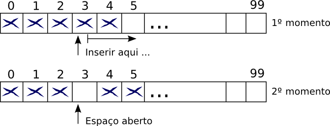
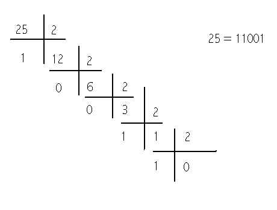

# Revisão de Java (prática)

## Exercício 1

Calcular e mostrar o valor de PI utilizando a série de Gregory:

$$\frac{\pi}{4} = \frac{1}{1} - \frac{1}{3} + \frac{1}{5} - \frac{1}{7}
  + \frac{1}{9} - \dotsb$$

## Exercício 2

Inserir um inteiro em uma posição `i` de um vetor usando deslocamento
caso `i` estiver ocupada. Assuma que células com valor zero são
vazias (e portanto são espaços livre que podem ser preenchidos).
**O vetor não pode ser redimensionado!**

Exemplo: inserir 10 na posição 3

```java
int[] vetor = {25, 14, 56, 15, 36, 56, 77, 18, 29, 49}; // Cheio
int[] vetor = {25, 14, 0, 15, 36, 56, 77, 18, 29, 49};  // Não pode
int[] vetor = {25, 14, 56, 0, 36, 56, 77, 18, 29, 49};  // Pode
int[] vetor = {25, 14, 56, 15, 36, 0, 77, 18, 29, 49};  // Pode
```

<p align="center">
  

  Fonte: https://www.caelum.com.br/apostila-java-estrutura-dados/vetores/
</p>

## Exercício 3

Implemente um **método recursivo** que converta um número inteiro
positivo em binário (`String`).

Exemplo: 25 (inteiro) = `"11001"` (binário).

<p align="center">
  

  Fonte: http://www.raymundodeoliveira.eng.br/binario.html
</p>

## Exercício 4

Crie uma função que retorna todos os números primos menores que
um dado valor `N`. Use o **crivo de Eratóstenes**.

O programa que usa a função, deve imprimir 10 números por linha.

## Exercício 5

Ordene um vetor de inteiros de forma crescente (ordenação por
seleção, crescente). O vetor pode ter repetições.

    Entrada: 20, 8, 6, 7, 8, 10, 22, 12, 18, 15
    Saída:   6, 7, 8, 8, 10, 12, 15, 18, 20, 22