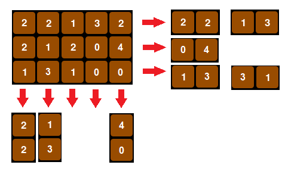

# Chocolate de aniversário [2]

Lilita dessa vez tem uma barra de chocolate e vai dividir novamente com 
seu amigo aniversariante Manolito. Cada bloquinho da barra de chocolate 
é identificado por um número inteiro e ela dividirá novamente em 
seguimentos continuos da barra, tal que o comprimento coincida com o
mês do aniversário de Manolito e a soma dos inteiros que identificam os
bloquinhos é exatamente igual do dia do aniversário de Manolito.

Por exemplo, suponha que Lilita tenha uma barra de chocolate com 15
bloquinhos, divididos em 3 linhas e 5 colunas identificados como na figura 
a seguir. E o aniversario de Manolito é dia 4 de Fevereiro, logo 
`Dia = 4` e `Mes = 2``. Neste caso há oito seguimentos de comprimento
2 de bloquinhos de chocolate que somam 4 e que Lilita pode escolher, veja:

  

Faça um programa que determine quantas formas Lilita pode dividir sua
barra de chocolate com Manolito.

## Entrada

O programa conta com apenas um caso de teste.

Cada caso de teste é composto por 3 linhas.

A primeira linha do caso de teste contem dois números inteiros `N` e `M`,
representando a quantidade de linhas e de colunas da barra de chocolate de 
Lilita possui.

Nas `N` linha seguintes há uma sucessão de `M` números inteiros cada linha, 
separados por um espaço em branco, representando os `N x M` identificadores 
que contem cada bloquinho da barra de chocolate de Lilita.

Na `N + 1` linha contém dois números inteiros `Dia` e `Mes`, separados por 
um espaço em branco, represetando respectivamente o dia e o mês do 
aniversário de Manolito.

### Restrições

- 1 ≤ `N`, `M` ≤ 100
- 0 ≤ `Cij` ≤ 5, onde 0 ≤ `i` ≤ `N` e 0 ≤ `j` ≤ `M`
- 1 ≤ `Dia` ≤ 31
- 1 ≤ `Mes` ≤ 12
- `N`, `M` ≥ `Mes`
- Você não precisa validar a data informada, ela será sempre uma data válida.

## Saída

A saída consiste de uma linha contento um número inteiro represetando a 
quantidade de formas que Lilita pode dividir sua barra de chocolate com 
Manolito, segundo o critério. Após a impressão do número, salte uma linha.

## Exemplos

Para a entrada

    3 5
    2 2 1 3 2
    2 1 2 0 4
    1 3 1 0 0
    4 2

a saída deve ser

    8

Para a entrada

    4 5
    4 5 2 3 0
    9 5 1 2 3
    8 9 6 1 0
    3 0 1 2 5
    20 
    
a saída deve ser

    0