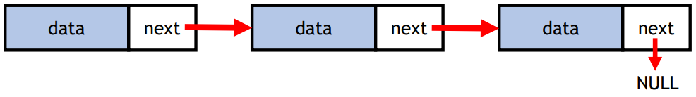
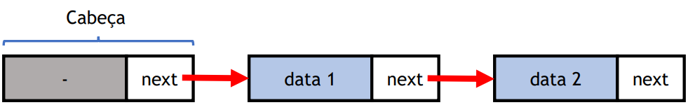
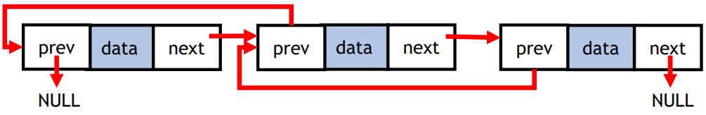
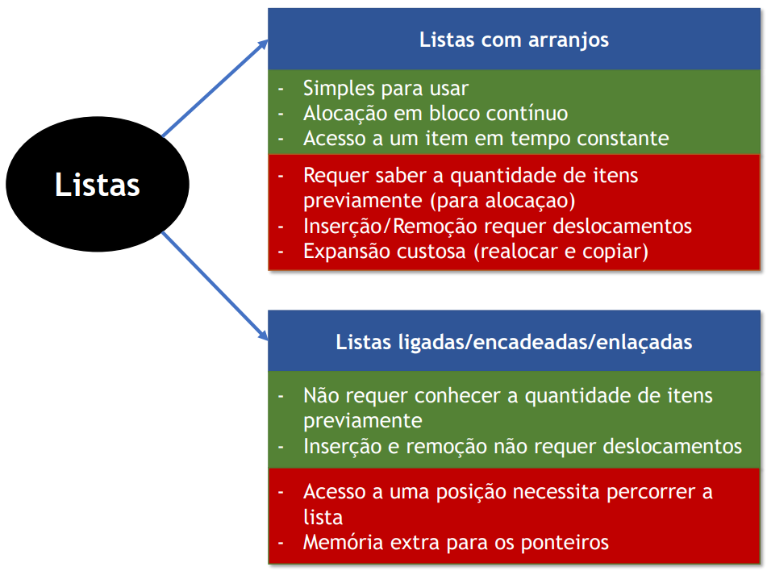

# Listas ligadas (prática)
*Retirado dos slides do Prof. Paulo H. Pisani e Prof. Saul C. Leite, CMCC/UFABC.*

## Listas com arranjos

- Itens dispostos em um arranjo sequencial.

<p align="center">
  
</p>

## Listas ligadas/encadeadas

- Cada item é ligado somente ao próximo item.

<p align="center">
  
</p>

Como implementar no Java?

```java
class LinkedNode {
  int data;
  LinkedNode next;
}
```

## Listas simplesmente ligadas

- Já criamos uma classe para representar os nós da lista ligada:
  `LinkedNode`;
- Agora vamos criar uma classe para gerenciar a lista ligada:
  `ListaLigada`.

```java
public class ListaLigada {
  private LinkedNode first = null;

  public void adicionaItemNoFinal(int item) {
    LinkedNode novoItem = new LinkedNode();
    novoItem.valor = item;
    novoItem.next = null;

    if (this.first == null) {
      this.first = novoItem;
    } else {
      LinkedNode anterior = null;
      LinkedNode atual = first;
      while (atual != null) {
        anterior = atual;
        atual = atual.next;
      }
      anterior.next = novoItem;
    } 
  }

  public void removeItem(int item) {
    LinkedNode anterior = null;
    LinkedNode atual = first;
    while (atual != null && atual.valor != item) {
      anterior = atual;
      atual = atual.next;
    }
    if (atual != null) { // Achou o item
      if (anterior == null)
        first = atual.next;
      else
        anterior.next = atual.next;
    }
  }

  public void imprimeListaLigada() {
    LinkedNode atual = first;
    while (atual != null) {
      System.out.print(atual.valor + " ");
      atual = atual.next;
    }
    System.out.print("\n");
  }
}
```

## Usando a lista ligada...

```java
public class TesteObjetos {

  public static void main(String[] args) {
    ListaLigada listaL = new ListaLigada();
    listaL.adicionaItemNoFinal(5);
    listaL.adicionaItemNoFinal(35);
    listaL.adicionaItemNoFinal(20);
    listaL.adicionaItemNoFinal(70);
    listaL.adicionaItemNoFinal(2);
    listaL.imprimeListaLigada();
    listaL.removeItem(20);
    listaL.imprimeListaLigada();
  }

}
```

## Modificadores de acesso...

- Podemos deixar a classe `LinkedNode` com acesso mais restrito,
  já que ela é usada apenas por `ListaLigada`:
  - Quem usa a classe `ListaLigada` não tem acesso aos nós diretamente;

## Modificadores de acesso em classes...

Classe `ListaLigada` **é pública** (o nome do arquivo segue o nome
desta classe).

```java
Arquivo: ListaLigada.java
public class ListaLigada {
  private LinkedNode first;

  public void adicionaItemNoFinal(int item) {
    // ...
  }

  public void removeItem(int item) {
    // ...
  }

  public void imprimeListaLigada() {
    // ...
  }
}
```

Classe `LinkedNode` **é pública**.

```java
Arquivo: LinkedNode.java
public class LinkedNode {
  int valor;
  LinkedNode next;
}
```

Classe `LinkedNode` tem acesso *package* (sem modificadores de acesso).

```java
Arquivo: LinkedNode.java
class LinkedNode {
  int valor;
  LinkedNode next;
}
```

Classe `LinkedNode` tem acesso *package (sem modificadores de acesso).
**Mas agora está no mesmo arquivo: `ListaLigada.java`**.

```java
Arquivo: ListaLigada.java
class LinkedNode {
  int valor;
  LinkedNode next;
}

public class ListaLigada {
  private LinkedNode first;

  public void adicionaItemNoFinal(int item) {
    // ...
  }

  public void removeItem(int item) {
    // ...
  }

  public void imprimeListaLigada() {
    // ...
  }
}
```

`LinkedNode` agora é uma classe interna a `ListaLigada` (desta forma,
apenas a classe `ListaLigada` pode usá-la).

```java
Arquivo: ListaLigada.java
public class ListaLigada {
  private class LinkedNode {
    int valor;
    LinkedNode next;
  }

  private LinkedNode first;

  public void adicionaItemNoFinal(int item) {
    // ...
  }

  public void removeItem(int item) {
    // ...
  }

  public void imprimeListaLigada() {
    // ...
  }
}
```

- Os 4 modificadores podem ser aplicados para **atributos** e **métodos**
  (como já discutimos em aula);
- Para **classes externas**:
  - Apenas `package` e `public` são permitidos.
- Para **classes internas (aninhadas)**:
  - Podemos usar os 4 modificadores.

## Exercício 01

- Crie um método para buscar um elemento na lista ligada. O método deve 
  retornar `true` se o elemente estiver na lista e, caso contrário,
  deve retornar `false`.

## Exercício 02

- Modifique a lista ligada para armazenar objetos da classe Contas 
  ao invés de considerar apenas números inteiros (`int`).

## Exercício 03

- Crie um método para inserir elementos de forma ordenada na lista ligada;
  - Por exemplo:
    - Lista contém os valores 5, 6, 90, 94, 150
    - Foi solicitada a inserção do elemento 92
    - Lista final será: 5, 6, 90, 92, 94, 150

## Exercício 04

- Crie um método para inverter a lista ligada (sem criar outra lista).

## Listas simplesmente ligadas com nó cabeça

- Cada item é ligado somente ao próximo item;
- O primeiro item não armazena dados da lista (e nunca é excluído);
- **Vantagem:** não é necessário verificar se a lista está vazia
  (o item cabeça nunca é removido).

<p align="center">
  
</p>

## Listas duplamente ligadas

- Cada item é ligado ao próximo item e também ao anterior;
- **Vantagem:** a lista pode ser percorrida em ambas as direções.

<p align="center">
  
</p>

## Resumo

<p align="center">
  
</p>

## Exercício 05

- Refazer os exercícios anteriores, mas agora para listas duplamente ligadas.

## Referências

- Documentação Java:
  https://docs.oracle.com/javase/8/docs/
- DEITEL, H. M.; DEITEL, P. J. Java: como
  programar. 6a edição. Porto Alegre, RS:
  Bookman, 2005.
- Thomas H. Cormen, Charles E. Leiserson,
  Ronald L. Rivest, Clifford Stein. Algoritmos:
  Teoria e Prática. Elsevier, 2012.