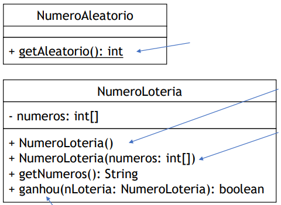

# Construtores, sobrecargas, relacionamentos (Aula prática)

## Exercício 01

- Vamos criar um sistema de loteria. Para isso, haverá duas classes no
  pacote loteria:

<p align="center">
  
</p>

- `NumeroAleatorio` calcula novo número aleatório;
- Construtor *default* cria classe com 3 números aleatórios (use a 
  classe `NumeroAleatorio`);
- Construtor com parâmetro usa os números do argumento ao invés
  dos números aleatórios (este construtor deve lançar uma exceção se o
  comprimento de números for diferente de 3);
- `ganhou()` compara o número passado como argumento com o número da
  instância.

- Implemente o programa `Loteria` no pacote `programa`. Esse
  programa lê um número `N` (quantidade de sorteios) e uma 
  **sequência de 3 números** digitada pelo usuário.
- O programa imprime os N sorteios e compara a sequência do usuário 
  com os números sorteados. Ao final, imprime se o usuário ganhou 
  ou não (ou seja, se acertou ao menos um dos sorteios).
- Faça duas versões:
  - Use `Math.random()` na classe `NumeroAleatorio`;
  - Use o método do middle square para calcular o número aleatório:
    https://en.wikipedia.org/wiki/Middle-square_method

## Coesão

- Com a modelagem usando uma classe separada para `getAleatorio()`
  **aumentamos a coesão**!
- Coesão refere-se à clareza das responsabilidades do módulo:
  - Alta coesão significa que possui apenas uma responsabilidade (e
    nada mais);
  - Baixa coesão significa que o módulo possui diversas responsabildades.
- `NumeroLoteria` apenas gerencia uma sequência sorteada;
- `NumeroAleatorio` apenas sorteia os números.
- Com maior coesão, aumentamos a capacidade de reutilização de módulos

  Por exemplo, se outra parte do programa precisar gerar números aleatórios,
  basta chamar o método da classe `NumeroAleatorio` (sem precisar usar 
  `NumeroLoteria`)
- Maior coesão também facilita a leitura do código e pode previnir erros.

## Exercício 02

Neste exercício, vamos criar uma classe para gerenciar números racionais.
Para isso, iremos criar um pacote, chamado `racional`, que possui a classe
`NumeroRacional`.

A classe `NumeroRacional` representa um número racional (com numerador
e denominador). *Os números devem ser armazenados em sua forma
simplificada*. Por exemplo, o número 4/8 deve ser armazenado como 1/2.
Esta classe contém:

- construtor que recebe como argumento dois números representando seu
  numerador e denominador, respectivamente.
- construtor padrão/default que inicializa o número com **numerador e
  denominador aleatórios (pode usar a classe `NumeroAleatorio` do
  Exercício 1, por exemplo)**.
- método `simplificar` (privado) que encontra o máximo divisor comum e
  simplifica a representação do número.
- método soma que recebe como argumento um número racional e faz a
  soma com a instância receptora.
- método `getString` que retorna uma string representando o número
  racional da seguinte forma: "numerador/denominador".

Lembre-se de sempre manter o número em sua forma simplificada.

## Como chamar o construtor sobrecarregado?

```java
package racional;

public class NumeroRacional {
  private int numerador;
  private int denominador;

  public NumeroRacional() {
    this(10, 1);
  }

  public NumeroRacional(int numerador, int denominador) {
    this.numerador = numerador;
    this.denominador = denominador;
    // ...
  }

  // ...
}
```

Importante! A chamada para outro construtor deve ser a primeira linha!

## Exercício 03

Agora vamos criar a classe `MatrizRacional`, que representa uma matriz 
`N` por `M`, em que cada elemento é um número racional. Esta classe contém:

- construtor padrão que inicia uma matriz de números racionais 3 por 3
  inicializados com valores aleatórios:
  - A cada chamada do construtor default, a matriz criada será maior: 
    3x3 (primeira chamada), 4x4 (segunda chamada), 5x5 (terceira chamada),
    ...
- construtor que recebe como argumento números `N` e `M` cria uma
  matriz `N` por `M` com números racionais inicializados com valores zero.
- método `soma` que recebe como argumento uma matriz racional de mesma
  dimensão e soma seus elementos aos elementos do objeto receptor
  (importante: lançar exceção se esse método for chamado com matriz
  de tamanho inválido)
- método `imprimir` que imprime a matriz na tela

O programa principal deve ser criado fora do pacote `racional`. Neste
programa, matrizes de números racionais devem ser instanciadas. Teste os
métodos implementados fazendo soma entre as matrizes e imprimindo o
resultado na tela.

## Exercício 04

Neste exercícios faremos um pacote `futebol` com as classes `Time`
e `Jogador`. A classe `Jogador` representa um jogador de futebol e deve 
conter os atributos nome e número de inscrição (NI). O NI é representado da
seguinte forma: "ddd.ddd.ddd-dd", em que d representa dígitos de 0 a 9.

A classe Jogador deve conter:

- construtor que recebe como argumento duas strings representando seu nome e 
  NI, respectivamente. Esse método deve lançar uma exceção se o NI for 
  inválido.
- construtor que recebe como argumento uma string representando seu nome e 
  um vetor de inteiros representando seu NI (11 inteiros). Cada elemento 
  deste vetor de inteiros representa um dígito do NI. Esse método deve 
  lançar uma exceção se o NI for inválido.
- método `private static verificaNI` que recebe como argumento uma string do 
  NI e verifica se este possui a estrutura descrita acima. O método lança 
  uma exceção se o NI estiver em formato inválido.
- Métodos get devem ser criados para o NI e para o nome.

A classe `Time` representa um time de futebol e deve conter um vetor de
jogadores. Os seguintes métodos devem ser implementados:

- `adicionaJogador` que recebe um objeto jogador para ser adicionado ao
  time.
- `adicionaJogador` que recebe como argumento nome e NI. O método deve
  lançar uma exceção se o NI for inválido.
- `removerJogador` que recebe como argumento o NI de um jogador e o
  remove da lista de jogadores. Quando ocorre uma remoção, o vetor deve
  manter-se contíguo (ou seja, se o primeiro jogar for removido, os demais
  jogadores deve ser movidos à esquerda no vetor).
- `imprimeEscalacao` que imprime a lista de jogadores mostrando NI e Nome.

O programa principal deve criado fora do pacote `futebol`. Teste as classes
implementadas neste programa, instanciando jogadores e times. Verifique se
as exceções são lançadas corretamente.
