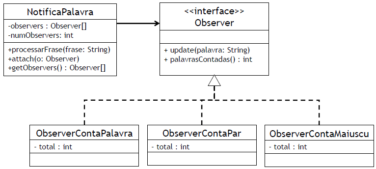

# Padrões de projetos
*Retirado dos slides do Prof. Paulo H. Pisani e Prof. Saul C. Leite, CMCC/UFABC.*

## Exercício 01 - Lista de notas

- O professor ABC escreveu um sistema para controlar as notas
  dos alunos. Entretanto, ele queria que cada aluno pudesse
  acessar apenas as suas notas;
- Além disso, o sistema teria a capacidade de autenticar
  o aluno de diversas formas. Para isso, ele resolveu
  usar o **padrão Strategy**.
- Entretanto, como o professor acabou de voltar de um
  congresso, não foi possível terminar de **implementar
  métodos de autenticação dos alunos**. Você pode ajudá-lo
  a terminar o sistema?
- O sistema completo deve possuir autenticação por
  senha (classe `AutenticacaoPorSenha`) e por swipe
  pattern (classe `AutenticacaoPorSwipe`).
- **Não altere as classes existentes!**

### `String[] args`

- O vetor `args` recebido no main do programa contém
  os valores passados como argumentos;
- Por exemplo:
      
      java Principal sala 507
- O vetor `args` terá dois elementos: `{"sala", "507"}`.

### Exercício 1 - Senha

- Na autenticação por senha, o usuário informa
  o login e a senha;
- A classe então verifica se a senha está correta;
- Para facilitar este exercício, considere que
  a senha correta sempre é "1234".
- O método de autenticação será passado por
  argumento ao programa.

      java SistemaNotas senha
      Digite o codigo:
      123
      Digite o nome:
      Aluno1
      Digite a SENHA:
      11111
      Impressao nao autorizada: autenticacao.UsuarioNauAutenticadoException: Usuario nao foi autenticado!
      Continuar? S/N
      S
      Digite o codigo:
      123
      Digite o nome:
      Aluno1
      Digite a SENHA:
      1234
      Notas do aluno: Aluno1
      ------------------------------
      - [123] POO Nota=10.0
      - [123] PE Nota=5.0
      - [123] PI Nota=2.0
      ------------------------------

      Continuar? S/N
      N

### Exercício 1 - Swipe

- Na autenticação por swipe pattern, imprima a matriz
  de pontos e laia a sequência do usuário.
- Para facilitar este exercício, considere que a 
  sequência correta é sempre "112233".

      java SistemaNotas swipe
      Digite o codigo:
      123
      Digite o nome:
      Aluno1
        1   2   3
      1  o   o   o
      2  o   o   o
      3  o   o   o

      Digite a sequencia de swipe (xy):
      123123
      Impressao nao autorizada: autenticacao.UsuarioNaoAutenticadoException: Usuario nao foi autenticado!
      Continuar? S/N
      S
      Digite o codigo:
      123
      Digite o nome:
      Aluno1
        1   2   3
      1  o   o   o
      2  o   o   o
      3  o   o   o

      Digite a sequencia de swipe (xy):
      112233
      Notas do aluno: Aluno1
      ------------------------------
      - [123] POO Nota=10.0
      - [123] PE Nota=5.0
      - [123] PI Nota=2.0
      ------------------------------

      Continuar? S/N
      N

## Exercício 02

- Revoltado com o baixo desempenho de seu time no Brasileirão,
  o professor ABC resolveu escrever um jogo para treinar seu time;
- O jogo simula cobranças de pênalti: o cobrador escolhe o
  lado do chute e o goleiro o lado da defesa. Se ambos escolherem
  o mesmo lado, o goleiro defende. Caso contrário, a bola entra
  no gol.
- Entretanto, um aluno da disciplina de POO disse que ele
  poderia melhorar o jogo, de modo que fosse possível
  jogar contra o computador;
- O aluno ainda completou e disse que faria isso usando o
  **padrão Strategy**!
- O novo jogo deve permitir escolher para cada jogador
  (**goleiro e cobrador**), se será uma **pessoa ou
  o computador**:
  - Para isso, use os argumentos passados ao
    programa da seguinte forma:

        java Treino P P => Cobrador=pessoa Goleiro=pessoa
        java Treino C C => Cobrador=computador Goleiro=computador
        java Treino C P => Cobrador=computador Goleiro=pessoa
        java Treino P C => Cobrador=pessoa Goleiro=computador

### Exemplos de saídas

```
java Treino C C
--- Penalty 1 ---

--- Penalty 2 ---

--- Penalty 3 ---

[Computador] Gols = 1  [Computador] Defesas = 2
```

```
java Treino C P
--- Penalty 1 ---
Qual lado voce vai defender? 1=esquerda 2=meio 3=direita
1

--- Penalty 2 ---
Qual lado voce vai defender? 1=esquerda 2=meio 3=direita
2

--- Penalty 3 ---
Qual lado voce vai defender? 1=esquerda 2=meio 3=direita
3

[Computador] Gols = 2  [Paulo] Defesas = 1
```

```
$ java Treino P C
--- Penalty 1 ---
Qual lado voce vai chutar? 1=esquerda 2=meio 3=direita
1

--- Penalty 2 ---
Qual lado voce vai chutar? 1=esquerda 2=meio 3=direita
1

--- Penalty 3 ---
Qual lado voce vai chutar? 1=esquerda 2=meio 3=direita
2

[Saul] Gols = 0  [Computador] Defesas = 3
```

## Exercício 03

- O professor ABC adicionou um sistema de *logging*
  no sistema de registro de plano de ensino;
- Dessa forma, ele pode guardar um registro de todas
  as ações executadas em um arquivo;
- **Contudo, ele cometeu alguns erros e o arquivo de
  log está perdendo dados**;
- Um aluno de POO recomendou que ele usasse **o padrão
  Singleton**. Dessa forma, ele evita instanciar a classe
  mais de uma vez, o que acaba gerando o problema com
  o arquivo `log.txt`.
- a) Aplique o padrão Singleton no projeto Plano de Aulas
  - O arquivo `log.txt` deverá ter o seguinte conteúdo
    (após o programa passar a usar singleton):

        [1] Inicio do programa
        [2] Classe Plano instanciada
        [3] Aulas basicas foram criadas
        [4] Aula adicionada
        [5] Aula adicionada
        [6] Aula adicionada
        [7] Aula adicionada
        [8] Aula adicionada
        [9] Aula adicionada
        [10] Aula adicionada
        [11] Plano impresso
        [12] Formula obtida
        [13] Provas foram canceladas
        [14] Plano impresso
        [15] Formula obtida
        [16] Fim do programa
- b) Arrume o código da classe principal do programa,
  de forma que o arquivo de log sempre seja fechado
  (mesmo que uma exceção unchecked seja lançada,
  por exemplo).

## Exercício 04 - Padrão Observer
*Exercício do Prof. Eduardo Guerra (https://youtu.be/bHhD3d-JlIQ)*

Considere uma classe que recebe uma `String` e quebre ela
em palavras. Um dos requisitos do sistema é que sejam
contadas palavras com diferentes características.

- Dentro do contexto faça a seguinte implementação:
- a) Crie a classe `NotificaPalavra` que recebe a `String`
  e a quebra em palavras de acordo com sua quantidade
  de espaços. (Use o método `split` da classe `String`).
- b) Use o padrão Observer para criar notificações
  para as palavras recebidas. Implemente Observers
  para os seguintes casos: contar todas as palavras,
  contar palavras com quantidade de caracteres pares,
  e palavras começadas com maiúsculas.

Para a construção de suas classes, use o seguinte esquema:

<p align="center">
  
</p>

Crie uma classe principal para testar o projeto.
Instancia um objeto da classe NotificaPalavra,
adicione os observadores e chame o método
`processarFrase`.

Em seguida, imprima o total de palavras contadas
de cada objeto Observer.