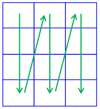
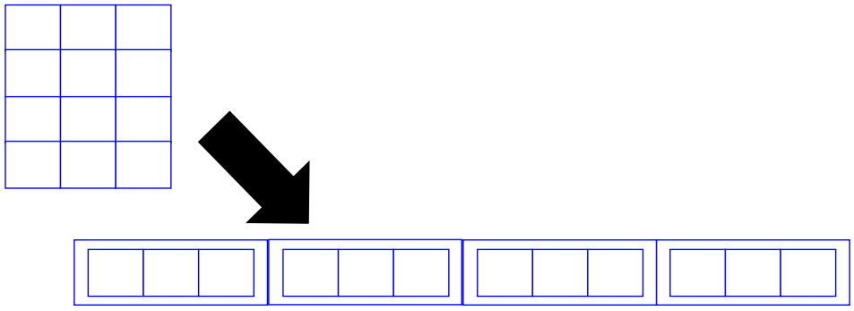

# Revisão de Java

## Programa mínimo

```java
public class Teste1 {
  public static void main(String[] args) {
    System.out.println("ABC");
  }
}
```

- Todo programa Java é uma classe (no caso, `Teste1`);
- Nome da classe deve ser o mesmo nome do arquivo;
- Classe do programa principal deve ter um método público `main`.
- Para compilar:
  
      javac Teste1.java

- Para executar:

      java Teste1.class

## Tipos de dados primitivos

| Tipo      | Descrição                             |
| --------: | ------------------------------------- |
| `byte`    | 1 byte (-128 a 127)                   |
| `short`   | Inteiro de 2 bytes (-32768 a 32767)   |
| `int`     | Inteiro de 4 bytes (-2^31 a 2^31 - 1) |
| `long`    | Inteiro de 8 bytes (-2^63 a 2^63 - 1) |
| `float`   | Real de 4 bytes                       |
| `double`  | Real de 8 bytes                       |
| `boolean` | `true`/`false`                        |
| `char`    | Caractere (2 bytes)                   |

## Tipos de dados

Inicialização de valores:

- Todo campo é inicializado automaticamente;
- Variáveis locais não são inicializadas;
- Boa prática: sempre inicialize as variáveis!

```java
public class Teste2 {
  public static void main(String[] args) {
    int a;
    System.out.println(a);
  }
}
```

    Teste2.java:4: error: variable a might not have been initialized.

## Saída: Impressão (tela)

- `print`/`println`/`printf`

  ```java
  public class Teste1 {
    public static void main(String[] args) {
      int a = 5;
      System.out.println("ABC");
      System.out.print("A");
      System.out.print("B");
      System.out.print("C");
      System.out.print("\n");
      System.out.printf("%d\n", a);
    }
  }
  ```
- Concatenação de Strings: `+`

  ```java
  public class Teste1 {
    public static void main(String[] args) {
      int a = 5;
      System.out.println("UF" + "ABC");
      System.out.println("Distancia=" + a + "Km");
    }
  }
  ```

## Entrada: Teclado

- Objeto Scanner:
  - Importar: `java.util.Scanner;`

```java
import java.util.Scanner;

public class Teste1 {
  public static void main(String[] args) {
    Scanner leitor = new Scanner(System.in);
    int a = leitor.nextInt();
    System.out.println(a);
  }
}
```

| Tipo      | Método          |
| --------: | --------------- |
| `byte`    | `nextByte()`    |
| `short`   | `nextShort()`   |
| `int`     | `nextInt()`     |
| `long`    | `nextLong()`    |
| `float`   | `nextFloat()`   |
| `double`  | `nextDouble()`  |
| `boolean` | `nextBoolean()` |
| `String`  | `next()`        |

## Operadores aritméticos

| Operador | Descrição        |
| :------: | ---------------- |
| `+`      | Soma             |
| `-`      | Subtração        |
| `*`      | Multiplicação    |
| `/`      | Divisão          |
| `%`      | Resto da divisão |

## Operadores relacionais

| Operador | Descrição        |
| :------: | ---------------- |
| `<`      | Menor que        |
| `>`      | Maior que        |
| `<=`     | Menor ou igual a |
| `>=`     | Maior ou igual a |
| `==`     | Igual a          |
| `!=`     | Diferente de     |

## Operadores lógicos

| Operador | Descrição |
| :------: | --------- |
| `&&`     | E         |
| `||`     | Ou        |
| `!`      | Negação   |

## Estruturas condicionais

```java
if (<condicao>) {

}

if (<condicao>) {

} else {

}

<condicao> ? <retorno verdadeiro> : <retorno falso>;
```

## Estruturas de repetição

### While

```java
while (<condicao>) {

}
```

Exemplo:

```java
int i = 0;
while (i < 3) {
  i++;
  System.out.println(i);
}
```

Saída:

```
1
2
3
```

### Do-While

```java
do {

} while (<condicao>);
```

Exemplo:

```java
int i = 0;
do {
  System.out.println("1");
  i++;
} while (i < 3);
```

Saída:

```
1
1
1
```

### For

```java
for (<inicializacao>; <condicao>; <passo>) {

}
```

Exemplo:

```java
for (int i = 0; i < 3; i++) {
  System.out.println(i);
}
```

Saída:

```
0
1
2
```

## Operadores de atribuição

| Operador | Descrição                       |
| :------: | ------------------------------- |
| `++`     | Incremento unitário             |
| `--`     | Decremento unitário             |
| `+=`     | Atribuição por soma             |
| `-=`     | Atribuição por subtração        |
| `*=`     | Atribuição por multiplicação    |
| `/=`     | Atribuição por divisão          |
| `%=`     | Atribuição por resto da divisão |

## Vetores

- **Declarar** vetor:

  ```java
  <tipo>[] <nome>;
  ```

- **Instanciar** vetor:

  ```java
  <nome> = new <tipo>[<tamanho>];
  ```

Exemplos:

```java
int[] vetor;
vetor = new int[8];

double[] vetor2 = new double[10];
```

- **Acessar** valores em um vetor:

  ```java
  vetor[4];
  ```

  Acessa elemento de índice 4. Índices começam no 0 (zero).

- **Ler/Imprimir** elemento de vetor:

  ```java
  Scanner leitor = new Scanner(System.in);
  int vetor[] = new int[8];

  vetor[0] = leitor.nextInt();
  System.out.println(vetor[0]);
  ```

<p align="center">
  
</p>

- **Percorrer** um vetor:

  ```java
  int[] vetor = new int[5];
  for (int i = 0; i < 5; i++) {
    vetor[i];
  }
  ```

  O que faz esse código?

  ```java
  int[] vetor = new int[5];
  for (int i = 0; i < 5; i++) {
    vetor[i] = (i + 1) * (i + 1);
  }
  ```

- **Diferentes formas de declarar** vetor:

  ```java
  <tipo>[] <nome>;
  <tipo> <nome>[];
  ```

  Exemplos:

  ```java
  int[] vetor;
  vetor = new int[8];

  double[] vetor2 = new double[10];

  int[] a, b;
  int c[], d;
  ```

- **Ler valores do teclado**:

  ```java
  import java.util.Scanner;

  public class Teste1 {
    public static void main(String[] args) {
      Scanner leitor = new Scanner(System.in);

      double vetor[] = new double[5];
      for (int i = 0; i < 5; i++)
        vetor[i] = leitor.nextDouble();

      double soma = 0;
      for (int i = 0; i < 5; i++)
        soma += vetor[i];

      System.out.println(soma);
    }
  }
  ```

- **Comprimento** do vetor:

  ```java
  import java.util.Scanner;

  public class Teste1 {
    public static void main(String[] args) {
      Scanner leitor = new Scanner(System.in);

      int tamanho = leitor.nextInt();
      double vetor[] = new double[tamanho];
      for (int i = 0; i < vetor.length; i++)
        vetor[i] = leitor.nextDouble();

      double soma = 0;
      for (int i = 0; i < vetor.length; i++)
        soma += vetor[i];

      System.out.println(soma);
    }
  }
  ```

- **Atenção com os limites do vetor!**

  ```java
  import java.util.Scanner;

  public class Teste1 {
    public static void main(String[] args) {
      Scanner leitor = new Scanner(System.in);

      int tamanho = leitor.nextInt();
      double v[] = new double[tamanho];
      for (int i = 0; i < v.length; i++)
        v[i] = leitor.nextDouble();

      double s = 0;
      for (int i = 0; i <= v.length; i++)
        soma += v[i];

      System.out.println(soma);
    }
  }
  ```

  ```
  Exception in thread "main": java.lang.ArrayIndexOutOfBoundsException
  ```

### Enhanced For Loop (vetor)

```java
public class Teste1 {
  public static void main(String[] args) {
    double vetor[] = new double[6];
    for (int i = 0; i < 6; i++)
      vetor[i] = 5 * i;

    for (double elemento : vetor) {
      System.out.print(elemento + " ");
    }
  }
}
```

## Matrizes

- **Declarar** matriz:

  ```java
  <tipo>[][] <nome>;
  ```

- **Instanciar** matriz:

  ```java
  <nome> = new <tipo>[<tamanho1>][<tamanho2>];
  ```

  Exemplos:

  ```java
  int[][] matriz;
  matriz = new int[4][3];

  double[][] matriz2 = new double[4][3];
  ```

- **Acessar** valores em uma matriz:

  ```java
  vetor[2][1];
  ```

  Índices começam no 0 (zero).

- **Ler/Imprimir** elemento da matriz:

  ```java
  Scanner leitor = new Scanner(System.in);
  int[][] matriz = new int[4][3];

  matriz[2][1] = leitor.nextInt();
  System.out.println(vetor[2][1]);
  ```

- **Percorrer** uma matriz:

  ```java
  int[][] matriz = new int[4][3];
  for (int i = 0; i < 4; i++) {
    for (int j = 0; j < 3; j++) {
      matriz[i][j];
    }
  }
  ```

  O que faz esse código?

  ```java
  int[][] matriz = new int[4][3];
  for (int i = 0; i < 4; i++) {
    for (int j = 0; j < 3; j++) {
      matriz[i][j] = (i + 1) * (j + 1);
    }
  }
  ```

- **Comprimento das dimensões** de uma matriz:

  ```java
  import java.util.Scanner;

  public class Teste1 {
    public static void main(String[] args) {
      Scanner leitor = new Scanner(System.in);

      double[][] matriz = new double[4][3];
      int n = 1;
      for (int i = 0; i < matriz.length; i++)
        for (int j = 0; j < matriz[i].length; j++)
          matriz[i][j] = n++;

      System.out.println(matriz[3][2]);
    }
  }
  ```

### Percurso em matrizes

<p align="center">
  
</p>

```java
int[][] matriz = new int[4][3];
for (int i = 0; i < 4; i++) {
  for (int j = 0; j < 3; j++) {
    matriz[i][j];
  }
}
```

<p align="center">
  
</p>

```java
int[][] matriz = new int[4][3];
for (int j = 0; j < 3; i++) {
  for (int i = 0; i < 4; j++) {
    matriz[i][j];
  }
}
```

<p align="center">
  
</p>

### Enhanced For Loop (matriz)

```java
public class Teste1 {
  public static void main(String[] args) {
    double[][] matriz = new double[4][3];
    int n = 1;
    for (double[] linha : matriz) {
      for (int j = 0; j < linha.length; j++) {
        linha[j] = n++;
      }
    }

    System.out.println(matriz[3][2]);
  }
}
```

### Matriz é um vetor de vetores

Internamente, a matriz é um vetor unidimensional,
em que cada elemento é um vetor unidimensional.

<p align="center">
  
</p>

### Enhanced For Loop (matriz)

O código abaixo não altera os valores da matriz.

```java
public class Teste1 {
  public static void main(String[] args) {
    double[][] matriz = new double[4][3];
    int n = 1;
    for (double[] linha : matriz) {
      for (double elemento : linha) {
        elemento = n++;
      }
    }

    System.out.println(matriz[3][2]);
  }
}
```

## <strike>Funções</strike> Métodos

```java
public class Teste1 {
  public static <retorno> <nome_metodo>(<parametros>) {

  }

  public static void main(String[] args) {

  }
}
```

```java
import java.util.Scanner;

public class Teste1 {
  public static boolean metodoMisterioso(int n) {
    if (n <= 1) return false;
    if (n <= 3) return true;
    if (n % 2 == 0 || n % 3 == 0) return false;
    for (int i = 5; i * i <= n; i += 2)
      if (n % i == 0) return false;
    return true;
  }

  public static void main(String[] args) {
    Scanner leitor = new Scanner(System.in);
    int numero = leitor.nextInt();
    System.out.println(metodoMisterioso(numero));
  }
}
```

## Exemplo 1

Crie uma <strike>função</strike> método que retorne quantos
elementos ímpares há em um vetor.

```java
public static int contaImpares(int[] vetor) {
  int soma = 0;
  for (int i = 0; i < vetor.length; i++) {
    if (vetor[i] % 2 == 1)
      soma++;
  }
  return soma;
}
```

Todo vetor é um objeto em Java. **Objetos** são passados
por **referência**. **Tipos** primitivos são passados por
**valor**.

## Exemplo 2

Crie uma <strike>função</strike> método que retorne quantos
elementos primos há em um vetor.

```java
public static int contaImpares(int[] vetor) {
  int soma = 0;
  for (int elemento : vetor) {
    if (metodoMisterioso(elemento))
      soma++;
  }
  return soma;
}
```

## Métodos com número indefinido de argumentos (*varargs*)

Usamos `...` para permitir que um **parâmetro** receba um
número **variável** de **argumentos**.

```java
public static <tipo_ret> <metodo> (<tipo_p> ...<nome_p>) {

}
```

O parâmetro passa a ser um vetor do tipo informado.

## Exemplo 3

Crie uma <strike>função</strike> método que retorne quantos
elementos primos há em um conjunto indeterminado de vetores
(use *varargs*).

```java
public static int contaPrimosMultiplo(int[] ...vetor) {
  int soma = 0;
  for (int[] vetorAtual : vetor) {
    soma += contaPrimos(vetorAtual);
  }
  return soma;
}
```

## Exemplo 4

Copie os dados de um vetor em outro, dobre os valores no
vetor original e imprima os dois vetores.

Repita o exercício anterior, agora para uma matriz.

## Exemplo 5

Crie uma <strike>função</strike> método que ordene os
elementos de um vetor de inteiros (utilize o algoritmo
de ordenação por seleção):

- Implemente uma versão iterativa e uma versão recursiva.

```java
public static void ordenaSelectionRec(int[] vetor, int indice) {
  if (indice >= vetor.length - 1) return;

  int menorValor = vetor[indice];
  int menorIndice = indice;
  for (int i = indice + 1; i < vetor.length; i++) {
    if (vetor[i] < menorValor) {
      menorValor = vetor[i];
      menorIndice = i;
    }
  }

  vetor[menorIndice] = vetor[indice];
  vetor[indice] = menorValor;

  ordenaSelectionRec(vetor, indice + 1);
}
```

## Exemplo 6

Crie uma função que retorna todos os números primos menores
que um dado valor `N`. Use o **crivo de Eratóstenes**.

O programa que usa a função, deve imprimir 10 números por linha.

## Exemplo 7

Crie uma função `wordUpperCase`, que recebe uma `String` como
parâmetro. A função retorna essa `String` com todas as
primeiras letras das palavras em letras maíusculas.

Por exemplo:
- Argumento: `"isso eh um teste"`
- Retorno: `"Isso Eh Um Teste"`

## Exemplo 8

Escreva um programa que gera uma sequência de `N` números
inteiros aleatórios entre 1 e 20. Após isso, imprima a média
e a mediana da sequência gerada.

- Use `Math.random`.

## Exemplo 9

Escreva uma função que receba duas palavras e retorne `true`
se uma palavra é anagrama da outra.

## Referências

- Documentação Java:
  https://docs.oracle.com/javase/8/docs/

- DEITEL, H. M.; DEITEL, P. J. Java: como programar. 6ª edição.
  Porto Alegre, RS: Bookman, 2005.

- Thomas H. Cormen; Charles E. Leiserson; Ronald L. Rivest;
  Clifford Stein. Algoritmos: Teoria e Prática. Elsevier, 2012.