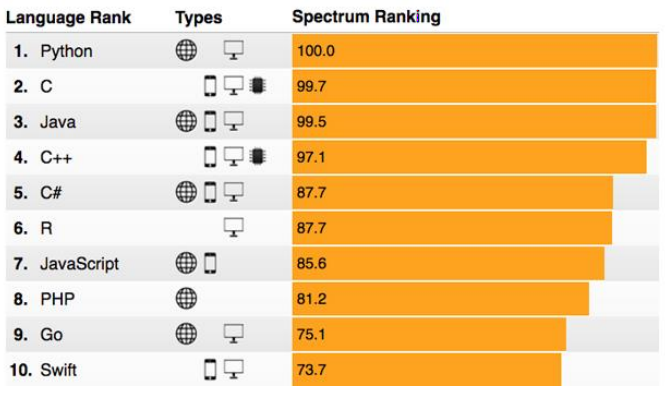
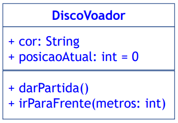
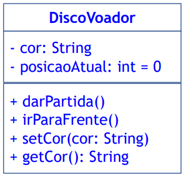

# Classes, objetos, mensagens, encapsulamento, UML

## Conceitos Gerais

### Motivação 

- Tenta solucionar problemas da programação estruturada (PE):
  - Em PE, não é possível criar uma conexão forte entre dados e
    funcionalidades;
  - Manutenção, Produtividade, Reuso de código.
- Exemplo:
  - Validação de campos;
  - Acesso a diferentes gerenciadores de banco de dados.

### Programação Orientada a Objetos

- Paradigma de programação baseado no princípio de 
  "imitar o mundo real":
  - Nossa vida está repleta de **objetos físicos** (carro, livro,
    impressora etc.) **e abstratos** (pergunta, esquema tático,
    plano de aulas etc.);
  - Objeto é tudo aquilo que tem **atributos** e **comportamentos**.

<p align="center">
  

  https://spectrum.ieee.org/computing/software/the-2017-top-programming-languages
</p>

<p align="center">
  

  https://www.tiobe.com/tiobe-index/
</p>

<p align="center">
  

  https://octoverse.github.com/
</p>

### POO

- Os programas são organizados por elementos chamados **classes**;
- Conceitos importantes em POO:
  - **Abstração**
  - **Encapsulamento**
  - **Herança**
  - **Polimorfismo**

### Classe

- É uma **abstração** de um objeto:
  - É um modelo para criar um objeto;
  - Na abstração, desconsideramos detalhes irrelevantes.
- Uma classe **encapsula** comportamentos.

```java
public class DiscoVoador {
  public String cor;
  public void darPartida() {
    // Implementação.
  }
  public void irParaFrente(int metros) {
    // Implementação
  }
}
```

### UML (Unified Modeling Language)

- Linguagem de modelagem unificada: **linguagem visual** para
  **modelagem** de softwares utilizando orientação a objetos.
- Por que **modelar** software?
  - Planejamento da estrutura de um sistema antes de construí-lo:
    prever evolução, manutenção.
  - Paralelo com a construção de uma casa:
    - Troca de fiação;
    - Manutenção em encanamentos.
- **A UML é composta por diversos diagramas:** casos de uso,
  classes, objetos, pacotes, sequência, comunicação, máquina de estados,
  atividade, componentes, implantação, tempo, estrutura composta etc.
- Cada diagrama é usado para modelar o sistema sob uma determinada ótica.
- Neste curso, veremos o **diagrama de classes**.

### UML - Diagrama de Classe

- Define a estrutura das classes adotadas pelo software: **atributos,
  métodos e relacionamentos**;
- Um dos mais utilizados e importantes diagramas da UML (serve como
  apoio para os demais diagramas).

<p align="center">
  
</p>

```java
public class DiscoVoador {
  public String cor;
  public int posicaoAtual = 0;
  public void darPartida() {
    System.out.println("Motor ligado!");
  }
  public void irParaFrente() {
    posicaoAtual += metros;
  }
}
```

<p align="center">
  
</p>

### Vamos instanciar um disco voador?

- Um **objeto** é uma **instância** de uma **classe**.

<p align="center">
  
</p>

```java
Arquivo: DiscoVoador.java
public class DiscoVoador {
  public String cor;
  public int posicaoAtual = 0;
  public void darPartida() {
    System.out.println("Motor ligado!");
  }
  public void irParaFrente() {
    posicaoAtual += metros;
  }
}
```

**Importante!** Cada arquivo `.java` pode ter apenas uma classe
pública (e o arquivo deve ter o nome da classe).

```java
Arquivo: TesteObjetos.java
public class TesteObjetos {
  public static void main(String[] args) {
    DiscoVoador discoVoadorAzul = new DiscoVoador();
    discoVoadorAzul.cor = "Azul";

    DiscoVoador discoVoadorVerde = new DiscoVoador();
    discoVoadorVerde.cor = "Verde";

    DiscoVoador discoVoadorLaranja = new DiscoVoador();
    discoVoadorLaranja.cor = "Laranja";
  }
}
```

`new`: **Instancia** um **objeto** da **classe**.

### Já instanciamos objetos antes...

```java
Scanner leitor = new Scanner(System.in);

int[] vetor;
vetor = new int[8];

double[] vetor2 = new double[10];
```

### Tipos de dados (com Wrapper)

- Java possui classes para seus tipos primitivos

| Tipo      | Wrapper     |
| --------: | :---------- |
| `byte`    | `Byte`      |
| `short`   | `Short`     |
| `int`     | `Integer`   |
| `long`    | `Long`      |
| `float`   | `Float`     |
| `double`  | `Double`    |
| `boolean` | `Boolean`   |
| `char`    | `Character` |

- Boxing:

  ```java
  Integer num1 = new Integer(10);
  Integer num2 = new Integer(2 * num1.intValue());
  System.out.println("num1=" + num1.intValue() + 
      " num2=" + num2.intValue());
  ```

- Autoboxing:

  ```java
  Integer num1 = 10;
  Integer num2 = 2 * num1;
  System.out.println("num1=" + num1 + " num2=" + num2);
  ```

### Atributos

- Dados que diferenciam um objeto de outro (e.g. cor)

```java
Arquivo: TesteObjetos.java
public class TesteObjetos {
  public static void main(String[] args) {
    DiscoVoador discoVoadorAzul = new DiscoVoador();
    discoVoadorAzul.cor = "Azul";

    DiscoVoador discoVoadorVerde = new DiscoVoador();
    discoVoadorVerde.cor = "Verde";

    DiscoVoador discoVoadorLaranja = new DiscoVoador();
    discoVoadorLaranja.cor = "Laranja";
  }
}
```

```java
Conta contaCorrente = new Conta();
contaCorrente.nomeTitular = "Fulano";
contaCorrente.agencia = 200;
contaCorrente.numeroConta = 6000;

DiscoVoador disco = new DiscoVoador();
disco.capacidade = 40;
disco.peso = 8000;
disco.dono = "Alien";
disco.preco = 1800.50;
```

### Métodos

- Realizam instruções relacionadas ao objeto.

```java
Arquivo: TesteObjetos.java
public class TesteObjetos {
  public static void main(String[] args) {
    DiscoVoador discoVoadorAzul = new DiscoVoador();
    discoVoadorAzul.cor = "Azul";
    discoVoadorAzul.darPartida();

    DiscoVoador discoVoadorVerde = new DiscoVoador();
    discoVoadorVerde.cor = "Verde";
    discoVoadorVerde.darPartida();
  }
}
```

```java
Conta contaCorrente = new Conta();
contaCorrente.depositar(500);
contaCorrente.depositar(100);
double saldo = contaCorrente.getSaldo();

Pilha pilha1 = new Pilha();
pilha1.empilha(4);
pilha1.empilha(8);
pilha1.empilha(3);
int valor = pilha1.desempilha();
valor = pilha1.desempilha();
```

Mensagens -> Chamadas de métodos no Java.

## Palavra-chave `this`

- Ponteiro para o próprio objeto;
- Apenas **métodos de instância** (não `static`) podem usá-lo.
- Voltando ao exemplo do disco voador:

  ```java
  Arquivo: DiscoVoador.java
  public class DiscoVoador {
    public String cor;
    public int posicaoAtual = 0;
    public void darPartida() {
      System.out.println("Motor ligado!");
    }
    public void irParaFrente() {
      this.posicaoAtual += metros;
    }
  }
  ```

  `posicaoAtual` é um membro de instância de `DiscoVoador` -> podemos
  usar `this`.
- Pode ser útil para lidar com parâmetros que possuem o mesmo nome
  de atributos.

  ```java
  public class DiscoVoador {
    public String cor;

    public void mudarCor(String cor) {
      this.cor = cor;
    }
  }
  ```

## Modificadores de acesso e Métodos modificadores

- Determinam a visibilidade de atributos, métodos e classes
  (ou seja, define quem pode acessar/modificar os atributos
  e utilizar os métodos):
  - `private`
  - `protected`
  - `public`
  - **Sem modificador** (package)

| | Própria classe | Pacote | Subclasses | "Mundo" |
| ----------------- | - | - | - | - |
| `public`          | S | S | S | S |
| `protected`       | S | S | S | N |
| (sem modificador) | S | S | N | N |
| `private`         | S | N | N | N |

https://docs.oracle.com/javase/tutorial/java/javaOO/accesscontrol.html

- Todos os atributos de `DiscoVoador` são `public`

  ```java
  Arquivo: DiscoVoador.java
  public class DiscoVoador {
    public String cor;
    public int posicaoAtual = 0;
    public void darPartida() {
      System.out.println("Motor ligado!");
    }
    public void irParaFrente() {
      posicaoAtual += metros;
    }
  }
  ```

  ```java
  DiscoVoador disco = new DiscoVoador();
  disco.irParaFrente(300);
  disco.irParaFrente(200);
  disco.posicaoAtual = 100;
  disco.posicaoAtual = 2000;
  ```

  Atributo `posicaoAtual` não está devidamente **encapsulado**!

  ```java
  Arquivo: DiscoVoador.java
  public class DiscoVoador {
    public String cor;
    private int posicaoAtual = 0;
    public void darPartida() {
      System.out.println("Motor ligado!");
    }
    public void irParaFrente() {
      posicaoAtual += metros;
    }
  }
  ```

  **Não compila!** Assim evita que o programador altere atributos
  de forma incorreta.

  Uso correto dos conceitos de POO ajuda a evitar erros de programação!

  Por exemplo, poderia haver alguma restrição de distância
  percorrida (que estaria sendo ignorada com a atribuição direta)

  ```java
  public void irParaFrente(int metros) {
    if ((metros >= 0) && (metros <= 100))
      posicaoAtual += metros;
  }
  ```

### Métodos modificadores (get/set)

- Todos os atributos são modificados apenas por métodos da classe:
  - Portanto, todos os atributos deixam de ser públicos.
    **Fortalece o encapsulamento**.
- Vantagens:
  - Melhora a legibilidade de código;
  - Facilita a manutenção e reutilização.
- Adotam o nome:
  - `get<nome_atributo>`
  - `set<nome_atributo>`
- É uma boa prática que qualquer atribuição utilize os métodos
  modificadores:
  - **Inclusive os métodos da própria classe**.

<p align="center">
  
</p>

- Aplicando no disco voador...

  ```java
  Arquivo: DiscoVoador.java
  public class DiscoVoador {
    private String cor;
    private int posicaoAtual = 0;
    public void darPartida() {
      System.out.println("Motor ligado!");
    }
    public void irParaFrente() {
      posicaoAtual += metros;
    }
    public void setCor(String cor) {
      this.cor = cor;
    }
    public void getCor() {
      return this.cor;
    }
  }
  ```
- Em UML

<p align="center">
  
</p>

- Com métodos modificadores, podemos adicionar validações
  (que acabam sendo aplicadas a qualquer parte do programa que
  altere o atributo);
- Por exemplo, no `DiscoVoador`, é possível atribuir qualquer
  `String` a `cor`:
  - Contudo, um `DiscoVoador`, pode ser "Cinza" ou "Verde" apenas.

  ```java
  Arquivo: DiscoVoador.java
  public class DiscoVoador {
    private String cor;
    ...
    public void setCor(String cor) {
      if ((cor == "Cinza") || (cor == "Verde")) {
        this.cor = cor}
      } else {
        System.out.println("Cor inválida!");
      }
    }
    public String getCor() {
      return this.cor;
    }
  }
  ```

### Métodos podem ser `private` também? Sim!

- Por exemplo, um método usado apenas pela classe não precisa ser
  exposto com `public`.

### Método `private` para validar cor

```java
private boolean validaCor(String cor) {
  return (cor == "Cinza") || (cor == "Verde");
}

public void setCor(String cor) {
  if (validaCor(cor)) {
    this.cor = cor;
  } else {
    System.out.println("Cor inválida!");
  }
}
```

## Pacotes

- É um grupo de tipos relacionados (classes, interfaces, enumeradores);
- Usado para organizar tipos, evitar conflitos de nomeação, controlar
  acesso.
- Exemplos de pacotes:
  - `java.lang`
  - `java.util` (onde está a classe `Scanner`)
  - `weka.core` (pacote para aprendizado de máquina: https://www.cs.waikato.ac.nz/ml/weka/)
  - `org.deeplearning4j` (https://deeplearning4j.org/)
- Vamos implementar um pacote chamado `estruturasdedados`;
  - Nomes de pacotes geralmente possuem todos os caracteres minúsculos;
- No pacote, haverá uma classe chamada `ListaFacil`.

### Classe `ListaFacil`

```java
Arquivo: estruturasdedados/ListaFacil.java
package estruturasdedados;

public class ListaFacil {

  public void iniciaLista(int tamanhoMax) {
    // ...
  }

  public void adicionarItem(int novoItem) {
    // ...
  }

  public int lerItem(int indice) {
    // ...
  }
}
```

### Usando a `ListaFacil`

```java
Arquivo: TesteObjetos.java
import estruturasdedados.ListaFacil;

public class TesteObjetos {

  public static void main(String[] args) {
    ListaFacil lista = new ListaFacil();
    lista.iniciaLista(3);
    lista.adicionarItem(9);
    lista.adicionarItem(10);
    lista.adicionarItem(11);
    lista.adicionarItem(12); // Erro
    System.out.println(lista.lerItem(0));
    System.out.println(lista.lerItem(1));
    System.out.println(lista.lerItem(2));
    System.out.println(lista.lerItem(3)); // Erro
  }
}
```

- Vamos implementar outro pacote: `espaco`;
- Neste pacote, haverá duas classes: `DiscoVoador` e `PortaDiscosVoadores`.

### `DiscoVoador`

```java
Arquivo: espaco/DiscoVoador.java
package espaco;

public class DiscoVoador {
  private String cor;
  private int posicaoAtual = 0;

  public void darPartida() {
    System.out.println("Motor ligado!");
  }

  public void irParaFrente(int metros) {
    posicaoAtual += metros;
  }

  public void setCor(String cor) {
    this.cor = cor;
  }

  public String getCor() {
    return this.cor;
  }
}
```

### `PortaDiscosVoadores`

```java
package espaco;

public class PortaDiscosVoadores {
  private DiscoVoador[] discos = new DiscoVoador[3];

  public void estacionarDisco(DiscoVoador disco) {

  }

  public DiscoVoador liberarDisco(int indice) {

  }
}
```

Aqui NÃO precisa de `import espaco.DiscoVoador`, pois estamos no
mesmo pacote!

```java
private int encontraIndiceLivre() {
  for (int i = 0; i < discos.length; i++) {
    if (discos[i] == null)
      return i;
  }
  return -1;
}

public void estacionarDisco(DiscoVoador disco) {
  int i = encontraIndiceLivre();
  if (i == -1) {
    System.out.println("Nao ha vagas!");
    return;
  }
  discos[i] = disco;
  disco.estacionado = true;
}
```

### Usando o pacote `espaco`

```java
import espaco.*;

public class TesteObjetos {
  public static void main(String[] args) {
    DiscoVoador discoVoadorAzul = new DiscoVoador();
    discoVoadorAzul.setCor("Azul");
    System.out.println(discoVoadorAzul);

    PortaDiscosVoadores portaDiscos = new PortaDiscosVoadores();
    portaDiscos.estacionarDisco(discoVoadorAzul);
    System.out.println(portaDiscos.liberarDisco(0));
  }
}
```

### Pacotes com `javac`

- Cada pacote fica em uma pasta/diretório:

  ```
  /TesteObjetos.java
  /estruturadedados/ListaFacil.java
  /espaco/DiscoVoador.java
  /espaco/PortaDiscosVoadores.java
  ```

- Compilação de classes em pacote:

  ```bash
  # Somente pacote estruturas de dados:
  javac estruturadedados/ListaFacil.java

  # Somente pacote espaco:
  javac espaco/*.java

  # Projeto todo:
  javac *.java
  ```

### Modificadores de acesso (em pacotes)

- Vamos adicionar um atributo `boolean estacionado` (sem modificador
  de acesso) na classe `DiscoVoador`;

  ```java
  Arquivo: espaco/DiscoVoador.java
  package espaco;

  public class DiscoVoador {
    boolean estacionado = false;
    ...
  }
  ```

<p align="center">
  
</p>

- A partir da classe `PortaDiscoVoadores`, vamos alterar o valor
  de `estacionado`.

  ```java
  Arquivo: espaco/PortaDiscosVoadores.java
  package espaco;
  public class PortaDiscosVoadores {
    ...
    public void estacionarDisco(DiscoVoador disco) {
      disco.estacionado = true;
      ...
    }
    ...
  }
  ```

- A partir do programa principal não conseguimos alterar o valor
  de estacionado!

  ```java
  Arquivo: TesteObjetos.java
  public class TesteObjetos {
    public static void main(String[] args) {
      DiscoVoador discoVoadorAzul = new DiscoVoador();
      discoVoadorAzul.estacionado = true;
    }
  }
  ```

  *Qual o pacote da classe `TesteObjetos`???* Pacote `default`.

- Os modificadores de acesso contribuem para o **encapsulamento**:
  - Aumentam o controle sobre atributos da classe;
  - Escondem detalhes (desnecessários) de como as classes são
    implementadas (atributos e métodos);
  - **Evitam erros dos programadores!**

## Exercício Extra 1

- Criar uma `ListaFacil` de `DiscoVoador` e usá-la em `PortaDiscosVoadores`.

## Exercício Extra 2

- O professor ABC planejou montar um sistema para acompanhar a copa
  do mundo. Nesse sistema haverá algumas classes:
  `TabelaCopaDoMundo`, `Jogo`, `Estadio`;
- Modele essas classes em UML e implemente em Java:
  - Quais atributos e métodos cada classe possui?
  - Implemente classes adicionais se necessário.

## Resumo da aula

<p align="center">
  
</p>

## Referências

- Slides do Prof. Monael P. Ribeiro:

  https://sites.google.com/site/poo2017q2/
- Slides do Prof. Vladimir Rocha (aula de Conceitos Gerais)
- Java e Orientação a Objetos - FJ11, Caelum

## Referências (projeto pedagógico)

- BOOCH, G.; RUMBAUGH, J.; JACOBSON, I.
  UML: guia do usuário. Rio de Janeiro, RJ:
  Campus, 2005.
- GUEDES, G. T. A. UML 2: uma abordagem
  prática. São Paulo, SP: Novatec, 2009.
- DEITEL, H. M.; DEITEL, P. J. Java: como
  programar. 6a edição. Porto Alegre, RS:
  Bookman, 2005.
- BARNES, D. J.; KOLLING, M. Programação
  orientada a objetos com Java. 4ª edição. São
  Paulo, SP: Editora Pearson Prentice Hall, 2009.
- FLANAGAN, D. Java: o guia essencial. 5ª edição.
  Porto Alegre, RS: Bookman, 2006.
- BRUEGGE, B.; DUTOIT, A. H. Object-oriented
  software engineering: using UML, patterns, and
  Java. 2ª edição. Upper Saddle River, NJ: Prentice
  Hall, 2003.
- LARMAN, C. Utilizando UML e padrões: uma
  introdução à análise e ao projeto orientados a
  objetos e ao desenvolvimento interativo. 3ª
  edição. Porto Alegre, RS: Bookman, 2007.
- FOWLER, M. UML essencial: um breve guia para a
  linguagem-padrão de modelagem de objetos. 3ª
  edição. Porto Alegre, RS: Bookman, 2005.