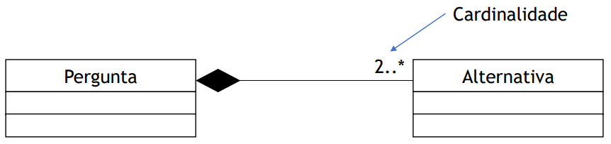
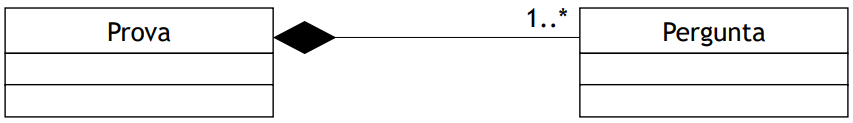
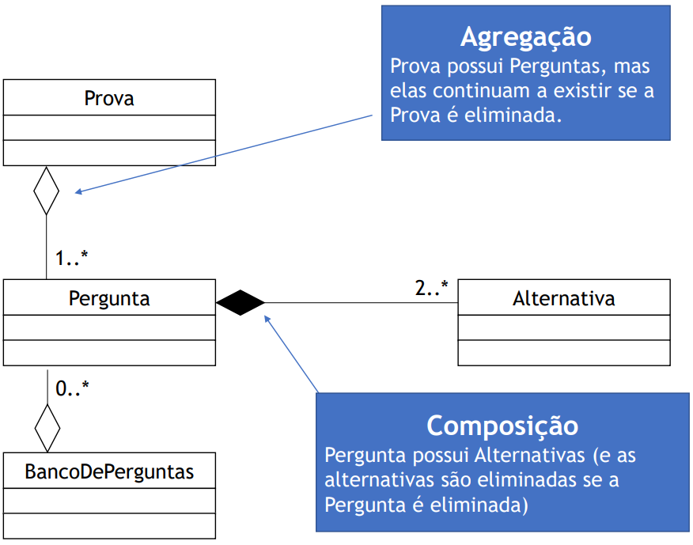
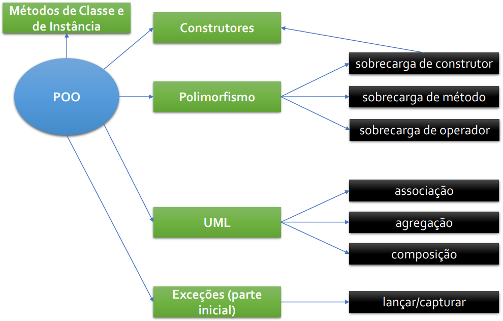

# Construtores, sobrecaras, relacionamentos

## Construtores

- São métodos especiais, chamados apenas quando a classe é instanciada
  (comando `new`):
  - São uteis para inicializar atributos.
- Algumas características desses métodos:
  - Possuem o mesmo nome da classe;
  - Não retornam valores.

```java
Arquivo: DiscoVoador.java
public class DiscoVoador {
  public String cor;

  public DiscoVoador() {
    this.cor = "Branco";
    System.out.println("Foi criado um disco voador!");
  }

  public void mudarCor(String cor) {
    this.cor = cor;
  }
}
```

### Vamos testar...

```java
Arquivo: TesteObjetos.java
public class TesteObjetos {
  public static void main(String[] args) {
    DiscoVoador discoVoadorAzul = new DiscoVoador();
    discoVoadorAzul.cor = "Azul";

    DiscoVoador discoVoadorVerde = new DiscoVoador();
    discoVoadorVerde.cor = "Verde";

    DiscoVoador discoVoadorLaranja = new DiscoVoador();
    discoVoadorLaranja.cor = "Laranja";
  }
}
```

### Construtor com parâmetros

```java
Arquivo: DiscoVoador.java
public class DiscoVoador {
  public String cor;

  public DiscoVoador(String cor) {
    this.cor = cor;
    System.out.println("Foi criado um disco voador!");
  }

  public void mudarCor(String cor) {
    this.cor = cor;
  }
}
```

### Vamos testar...

```java
Arquivo: TesteObjetos.java
public class TesteObjetos {
  public static void main(String[] args) {
    DiscoVoador discoVoadorAzul = new DiscoVoador("Azul");
    DiscoVoador discoVoadorVerde = new DiscoVoador("Verde");
    DiscoVoador discoVoadorLaranja = new DiscoVoador("Laranja");
  }
}
```

### Melhorando um pouco...

```java
Arquivo: DiscoVoador.java
public class DiscoVoador {
  public String cor;

  public DiscoVoador(String cor) {
    setCor(cor);
    System.out.println("Foi criado um disco voador!");
  }

  public void setCor(String cor) {
    this.cor = cor;
  }

  public String getCor() {
    return this.cor;
  }
}
```

### Prova

- A prova é composta por várias questões;
- As questões são de múltipla escolha.
- Vamos criar um sistema para aplicar provas:
  - Primeiro teremos três classes básicas no pacote `autocorrecao`:
    `Prova`, `Pergunta` e `Alternativa`.

### Classe: `Prova`

```java
package autocorrecao;

public class Prova {
  private Pergunta[] perguntas;
  private int indiceAtual;

  public Prova(int qtdPerguntas) {
    perguntas = new Pergunta[qtdPerguntas];
    indiceAtual = -1;
  }

  public void adicionarPergunta(Pergunta novaPergunta) {
    if (indiceAtual + 1 >= perguntas.length) {
      System.out.println("Limite atingido!");
      return;
    }
    indiceAtual++;
    perguntas[indiceAtual] = novaPergunta;
  }
}
```

### Classe: `Pergunta`

```java
package autocorrecao;

public class Pergunta {
  private String textoPergunta;
  private Alternativa[] alternativas;
  private int alternativaCorreta;
  private int indiceAtual;

  public Pergunta(int qtdAlternativas, String textoPergunta) {
    alternativas = new Alternativa[qtdAlternativas];
    alternativaCorreta = -1;
    indiceAtual = -1;
    this.textoPergunta = textoPergunta;
  }

  public void adicionarAlternativa(boolean correta, Alternativa alternativa) {
    if (indiceAtual+1 >= alternativas.length) {
      System.out.println("Limite de alternativas atingido!");
      return;
    }
    indiceAtual++;
    alternativas[indiceAtual] = alternativa;
    if (correta) {
      if (indiceAtual > 0) {
        System.out.println("Há outra alternativa correta!");
      } else {
        alternativaCorreta = indiceAtual;
      }
    }
  }
}
```

### Classe: `Alternativa`

```java
package autocorrecao;

public class Alternativa {
  String descricao;

  public Alternativa(String descricao) {
    this.descricao = descricao;
  }
}
```

### Criando uma prova

```java
Prova p1 = new Prova(2);

Pergunta q1 = new Pergunta(3, "Quanto eh 1 + 1?");
q1.adicionarAlternativa(true, new Alternativa("2"));
q1.adicionarAlternativa(false, new Alternativa("3"));
q1.adicionarAlternativa(false, new Alternativa("18"));
p1.adicionarPergunta(q1);

Pergunta q2 = new Pergunta(2, "Qual o valor de PI?");
q2.adicionarAlternativa(true, new Alternativa("3.14"));
q2.adicionarAlternativa(false, new Alternativa("80"));
p1.adicionarPergunta(q2);
```

## Sobrecargas

- Permite a existência de diversos métodos com o mesmo identificador
  (mesmo nome);
- Em POO, o método a ser chamado é escolhido de acordo com sua assinatura;
- Sobrecarga é um tipo de **polimorfismo**;
- **Vantagem**: permite que métodos com tarefas similares tenham o
  mesmo nome.

### Vamos sobrecarregar o método `adicionarAlternativa`

```java
public void adicionarAlternativa(boolean correta, String alternativa) {
  adicionarAlternativa(correta, new Alternativa(alternativa));
}

public void adicionarAlternativa(boolean correta, Alternativa alternativa) {
  if (indiceAtual+1 >= alternativas.length) {
    System.out.println("Limite de alternativas atingido!");
    return;
  }
  indiceAtual++;
  alternativas[indiceAtual] = alternativa;
  if (correta) {
    if (indiceAtual > 0) {
      System.out.println("Há outra alternativa correta!");
    } else {
      alternativaCorreta = indiceAtual;
    }
  }
}
```

### Criando uma prova  (com o método sobrecarregado)

```java
Prova p1 = new Prova(2);

Pergunta q1 = new Pergunta(3, "Quanto eh 1 + 1?");
q1.adicionarAlternativa(true, "2");
q1.adicionarAlternativa(false, "3");
q1.adicionarAlternativa(false, "18");
p1.adicionarPergunta(q1);

Pergunta q2 = new Pergunta(2, "Qual o valor de PI?");
q2.adicionarAlternativa(true, "3.14");
q2.adicionarAlternativa(false, "80");
p1.adicionarPergunta(q2);
```

### Vamos sobrecarregar o construtor também

- Vamos considerar que a prova pode ter um título agora:
  - Por padrão, o título é "Prova";
  - Mas pode ser especificado outro também.

### Sobrecarga de construtor

```java
public class Prova {
  private Pergunta[] perguntas;
  private int indiceAtual;
  private String titulo;

  public Prova(int qtdPerguntas) {
    perguntas = new Pergunta[qtdPerguntas];
    indiceAtual = -1;
    titulo = "Prova";
  }

  public Prova(int qtdPerguntas, String titulo) {
    perguntas = new Pergunta[qtdPerguntas];
    indiceAtual = -1;
    this.titulo = titulo;
  }
  // ...
}
```

### Criando uma prova (com o novo construtor)

```java
//Prova p1 = new Prova(2);
Prova p1 = new Prova(2, "Prova Final");

Pergunta q1 = new Pergunta(3, "Quanto eh 1 + 1?");
q1.adicionarAlternativa(true, "2");
q1.adicionarAlternativa(false, "3");
q1.adicionarAlternativa(false, "18");
p1.adicionarPergunta(q1);

Pergunta q2 = new Pergunta(2, "Qual o valor de PI?");
q2.adicionarAlternativa(true, "3.14");
q2.adicionarAlternativa(false, "80");
p1.adicionarPergunta(q2);
```

### Sobrecargas de operadores (C++)

- Permite implementar comportamentos específicos a operadores sobre
  classes;
  - Por exemplo: `+`, `-`, `++`, `*=` etc.
- Por exemplo, podemos fazer o seguinte:

  ```cpp
  Racional * n1 = new Racional(4, 2);
  Racional * n2 = new Racional(3, 2);
  Racional resultado = n1 + n2;
  ```
- Apenas alguns operadores podem ser sobrecarregados:
  - Por exemplo: `?:` não pode ser sobrecarregado.
- A ordem de precedência não pode ser alterada (assim como a aridade:
  unário, binário);
- Não há sobrecarga implícita:
  - Ou seja, sobrecarregar `+` não implica sobrecarregar `+=`.

Em Java não podemos sobrecarregar operadores. Mas isso não é tão ruim,
o uso abusivo de sobrecargas de operadores pode dificultar muito o
entendimento de um código.

Utilizar nomes métodos para as operações facilita a leitura (são
mais representativos em grande parte das situações).

## Relacionamentos

### Composição

- Relação de posse entre classes;
- Uma `Pergunta` possui `Alternativa`'s;
- Se a `Pergunta` deixa de existir, as `Alternativa`'s também
  são eliminadas.

<p align="center">
  
</p>

- Uma `Prova` possui `Pergunta`'s;
- Se a `Prova` deixa de existir, as `Pergunta`'s também são
  eliminadas.

<p align="center">
  
</p>

### Mas e neste caso?

- Além das classes `Prova`, `Pergunta` e `Alternativa`, agora o
  programa possui uma classe `BancoDePerguntas`;
- O `BancoDePerguntas` armazena todas as `Pergunta`'s que são
  usadas nas `Prova`'s.

Agora as `Prova`'s contém `Pergunta`'s, mas as `Pergunta`'s
podem existir sem uma `Prova` (pois estarão no `BancoDePerguntas`).
Isso caracteriza uma Agregação!

<p align="center">
  
</p>

### Associação

- Relacionamento mais fraco entre classes;
- Indica que as classes não dependem entre si (não há a relação
  "possui");
- Exemplo: relacionamento entre `Pessoa` e `Hotel`:
  - Ambos existem de forma independente;
  - Não há uma relação de posse/parte.

<p align="center">
  
</p>

## Métodos e atributos de classe

### Métodos e atributos de instância *vs* de classe

- Métodos e atributos de **instância** requerem uma instância
  para serem usados:
  - São únicos para cada **instância**.
- Métodos e atributos de **classe** não necessitam de uma
  instância:
  - Eles são compartilhados por todas as instâncias:
    - Alterar um atributo estático reflete em todas as instâncias.
  - Métodos de classe podem acessar apenas métodos e atributos
    de classe (não podem acessar métodos ou atributos de
    instância).

### Classe `Aluno`

```java
public class Aluno {
  private String nome;
  private int creditosCursados = 0;
  public static int numeroAlunos = 0;
  public int ra;

  public Aluno(String nome) {
    ra = ++numeroAlunos;
    this.nome = nome;
  }

  public int getRA() {
    return this.ra;
  }

  public static int getNumeroAlunos() {
    return numeroAlunos;
  }
}
```

### Vamos testar...

```java
Aluno aluno1 = new Aluno("ABC");
Aluno aluno2 = new Aluno("ABC");

// Atributos e métodos de instância são acessados
// por uma instância da classe.
System.out.println("RA1=" + aluno1.ra);
System.out.println("RA1=" + aluno1.getRA());
System.out.println("RA2=" + aluno2.ra);
System.out.println("RA2=" + aluno2.getRA());

// Atributos e métodos de classe são acessados usando o
// nome da classe, podendo ser acessados mesmo sem
// nenhuma instância.
System.out.println("Numero alunos = " + Aluno.numeroAlunos);
System.out.println("Numero alunos = " + Aluno.getNumeroAlunos());
```

### Questão

```java
System.out.println("1");
```

É um método de **classe** ou de **instância**?

### `System.out.println()`

- `System` é uma classe (no pacote `java.lang`);
- `out` é um atributo `public static` de `System`;
  - Esse atributo é do tipo `PrintStream` (outra classe
    em `java.lang`);
  - `out` é inicializado como uma instância de `PrintStream`;
- `println()` é um método de instância da classe `PrintStream`;

### Programas Java

- Como vimos, um programa Java é uma classe pública que possui
  **método de classe `main`**.

O que acontece quando chamamos

    java Programa <argumentos>

```java
Programa.main(<argumentos>);
```

1. `Programa` é a classe pública
2. `main` é um método de classe
3. Portanto, a classe principal do programa não é instanciada!
   Apenas é feita uma chamada a um método de classe.

### UML

- Em UML, atributos e métodos de classe são <u>sublinhados</u>;

```java
public class Aluno {
  private String nome;
  private int creditosCursados = 0;
  public static int numeroAlunos = 0;
  public int ra;

  public Aluno(String nome) {
    ra = ++numeroAlunos;
    this.nome = nome;
  }

  public int getRA() {
    return this.ra;
  }

  public static int getNumeroAlunos() {
    return numeroAlunos;
  }
}
```

<p align="center">
  
</p>

## Exceções (parte inicial)

- **Exceção** (evento expecional): evento que **quebra o fluxo
  normal** do programa;
- Muito usado para lidar com erros;
- Facilita a organização do código, pois separa o tratamento
  de erros do fluxo normal do programa.
- Exemplo 1 (acessar um item `null`):

  ```java
  Prova p2 = null;
  p2.imprimirProva();
  ```

      Exception in thread "main" java.lang.NullPointerException

- Exemplo 2 (acessar um índice inválido):

  ```java
  int[] vetor = new int[5];
  System.out.println(vetor[5]);
  ```

      Exception in thread "main" java.lang.ArrayIndexOutOfBoundsException: 5

- **Uma exceção quebra o fluxo normal do programa!**

  ```java
  System.out.println("Inicio do programa!");

  int[] vetor = new int[5];
  System.out.println(vetor[5]);

  System.out.println("Cheguei no final!");
  ```

  Saída:

      Inicio do programa!
      Exception in thread "main" java.lang.ArrayIndexOutOfBoundsException: 5

  Veja que o "Cheguei no final!" não é impresso.

### Vamos capturar exceções!

- Para capturar exceções, usamos o `try-catch`.

```java
try {
  // Código que pode lançar exceção.
} catch (Exception e) {
  // Tratamento da exceção.
}
```

Exemplo:

```java
try {
  System.out.println("Inicio do programa!");

  int[] vetor = new int[5];
  System.out.println(vetor[5]);

  System.out.println("Cheguei no final!");
} catch (Exception e) {
  System.out.println("Deu erro :-(");
}
System.out.println("Fim do programa!");
```

Saída:

    Inicio do programa!
    Deu erro :-(
    Fim do programa!

Veja que agora o fluxo do programa é interrompido apenas dentro
do bloco `try-catch`.

### Vamos melhorar isso...

```java
try {
  System.out.println("Inicio do programa!");

  int[] vetor = new int[5];
  System.out.println(vetor[5]);

  System.out.println("Cheguei no final!");
} catch (Exception e) {
  System.out.println("Deu erro :-(\n["
    + e.toString() + "]");
}
System.out.println("Fim do programa!");
```

Saída:

    Inicio do programa!
    Deu erro :-(
    [java.lang.ArrayIndexOutOfBoundsException: 5]
    Fim do programa!

### Aplicando Exceções nas classes `Prova` e `Pergunta`...

- Os métodos `adicionarPergunta` (classe `Prova`) e `adicionarAlternativa`
  (classe `Pergunta`) imprimem mensagens de erro para argumentos
  inválidos;
- Podemos aplicar Exceções para lidar com esses casos.

### Lançar uma exceção...

- Utilizamos o `throw`;
- Métodos que podem lançar exceções devem informar isso com `throws`.

```java
public void adicionarPergunta(Pergunta novaPergunta) throws Exception {
  if (indiceAtual + 1 >= perguntas.length) {
    //System.out.println("Limite de perguntas atingido!");
    //return;
    throw new Exception("Limite de perguntas atingido!");
  }
  indiceAtual++;
  perguntas[indiceAtual] = novaPergunta;
}

// A exceção criada no método sobrecarregado pode chegar até aqui,
// portanto requer o throws também.
public void adicionarAlternativa(boolean correta, String alternativa) throws Exception {
  adicionarAlternativa(correta, new Alternativa(alternativa));
}

public void adicionarAlternativa(boolean correta, Alternativa alternativa) throws Exception {
    if (indiceAtual+1 >= alternativas.length) {
    //System.out.println("Limite de alternativas atingido!");
    //return;
    throw new Exception("Limite de alternativas atingido!");
  }
  indiceAtual++;
  alternativas[indiceAtual] = alternativa;
  if (correta) {
    if (indiceAtual > 0) {
      //System.out.println("Há outra alternativa correta!");
      throw new Exception("Há outra alternativa correta!");
    } else {
      alternativaCorreta = indiceAtual;
    }
  }
}
```

### Criando uma prova (capturando exceções)

```java
Prova p1 = new Prova(2, "Prova Final");

Pergunta q1 = new Pergunta(3, "Quanto eh 1 + 1?");

try {
  q1.adicionarAlternativa(true, new Alternativa("2"));
  q1.adicionarAlternativa(false, new Alternativa("3"));
  q1.adicionarAlternativa(false, new Alternativa("18"));
  p1.adicionarPergunta(q1);

  Pergunta q2 = new Pergunta(2, "Qual o valor de PI?");
  q2.adicionarAlternativa(true, new Alternativa("3.14"));
  q2.adicionarAlternativa(false, new Alternativa("80"));
  p1.adicionarPergunta(q2);
} catch (Exception e) {
  System.out.println("Deu erro :-(\n[" + e.toString() + "]");
}
```

## Resumo da aula

<p align="center">
  
</p>

## Exercício 1

- Crie as classes `PlanoDeEnsino` e `Aula`:
  - `Aula`:
    - Possui apenas um construtor, que recebe o nome da aula
      como parâmetro;
  - `PlanoDeEnsino`:
    - Atributos: lista de aulas (array de `Aula`) e nome da
      disciplina (`String`)
    - Possui três construtores (sobrecarregados):
      - construtor default (sem parâmetros)
      - construtor que recebe o número de aulas como parâmetro
      - construtor que recebe o número de aulas e o nome da
        disciplina como parâmetros
    - Possui os métodos:
      - `adicionarAula`, que recebe um objeto da classe `Aula`
      - `adicionarAula`, que recebe uma `String` (com o nome da aula)

## Exercício 2

- Inclua um controle de quantidade de planos de ensino (usando
  um atributo `static`).

## Exercício 3

- Implemente uma sobrecarga do método `imprimir` da classe
  `Pergunta`, que receba um modo de operação:
  - Modo 1: imprimir as alternativas na ordem em que estão
    no vetor;
  - Modo 2: imprimir as alternativas em ordema aleatória.

## Referências

- Documentação Java:

  https://docs.oracle.com/javase/8/docs/
- Slides do Prof. Monael P. Ribeiro:

  https://sites.google.com/site/poo2017q2/

## Referências (projeto pedagógico)

- BOOCH, G.; RUMBAUGH, J.; JACOBSON, I.
  UML: guia do usuário. Rio de Janeiro, RJ:
  Campus, 2005.
- GUEDES, G. T. A. UML 2: uma abordagem
  prática. São Paulo, SP: Novatec, 2009.
- DEITEL, H. M.; DEITEL, P. J. Java: como
  programar. 6a edição. Porto Alegre, RS:
  Bookman, 2005.
- BARNES, D. J.; KOLLING, M. Programação
  orientada a objetos com Java. 4ª edição. São
  Paulo, SP: Editora Pearson Prentice Hall, 2009.
- FLANAGAN, D. Java: o guia essencial. 5ª edição.
  Porto Alegre, RS: Bookman, 2006.
- BRUEGGE, B.; DUTOIT, A. H. Object-oriented
  software engineering: using UML, patterns, and
  Java. 2ª edição. Upper Saddle River, NJ: Prentice
  Hall, 2003.
- LARMAN, C. Utilizando UML e padrões: uma
  introdução à análise e ao projeto orientados a
  objetos e ao desenvolvimento interativo. 3ª
  edição. Porto Alegre, RS: Bookman, 2007.
- FOWLER, M. UML essencial: um breve guia para a
  linguagem-padrão de modelagem de objetos. 3ª
  edição. Porto Alegre, RS: Bookman, 2005.